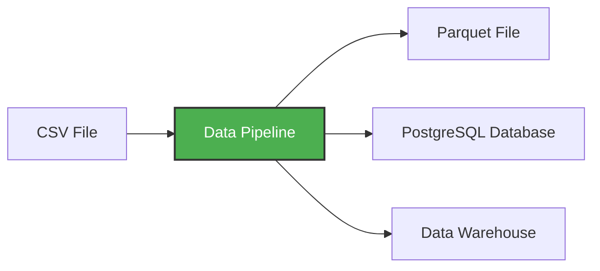

# Virtual Environments and Data Pipelines

**[↑ Up](README.md)** | **[← Previous](01-introduction.md)** | **[Next →](03-dockerizing-pipeline.md)**

https://www.youtube.com/watch?v=lP8xXebHmuE&list=PL3MmuxUbc_hJed7dXYoJw8DoCuVHhGEQb&index=11
28:01 Data engineering overview for building data pipelines


데이터 파이프라인은 데이터를 입력으로 받아 더 많은 데이터를 출력하는 서비스입니다. 예를 들어 CSV 파일을 읽어 데이터를 변환한 후 PostgreSQL 데이터베이스의 테이블 형태로 저장하는 것이 데이터 파이프라인의 한 예입니다.
A **data pipeline** is a service that receives data as input and outputs more data. For example, reading a CSV file, transforming the data somehow and storing it as a table in a PostgreSQL database.


이번 워크숍에서는 다음과 같은 파이프라인을 구축합니다.In this workshop, we'll build pipelines that:

웹에서 CSV 데이터를 다운로드하세요- Download CSV data from the web
pandas를 사용하여 데이터를 변환하고 정리합니다.- Transform and clean the data with pandas
쿼리를 위해 PostgreSQL에 로드합니다.- Load it into PostgreSQL for querying
대용량 파일을 처리하기 위해 데이터를 청크 단위로 처리합니다.- Process data in chunks to handle large files

## 간단한 파이프라인 생성 Creating a Simple Pipeline

예제 파이프라인을 만들어 보겠습니다. 먼저 디렉토리를 생성 pipeline하고 그 안에 파일을 생성합니다 pipeline.py.
Let's create an example pipeline.  First, create a directory `pipeline` and inside, create a file  `pipeline.py`:

pipeline 폴더 안에 pipeline.py 파일 추가


파일에 

```import sys
print('hello pipeline')
```
저장하고 터미널에서 해당 폴더 들어가서
python ./pipeline.py 하면 파일의 내용 실행됨


파일 내용을 다음으로 바꾸고 터미널에 python ./pipeline.py 12 하면 
```python
import sys
print("arguments", sys.argv)

day = int(sys.argv[1])
print(f"Running pipeline for day {day}")
```
```
@JBPark1417 ➜ /workspaces/data-engineering-learning/test/pipeline (main) $ python ./pipeline.py 12 #12를 argument로 넣는것이라함
arguments ['./pipeline.py', '12']
Running pipeline for day 12
```


이제 팬더스를 추가해 보겠습니다.
Now let's add pandas:

```python
import pandas as pd

df = pd.DataFrame({"A": [1, 2], "B": [3, 4]})
print(df.head())

df.to_parquet(f"output_day_{sys.argv[1]}.parquet")
```

## 가상 환경이 필요한 이유는 무엇일까요? Why Virtual Environments?

우리는 pandas가 필요하지만, 현재 설치되어 있지 않습니다. 컨테이너에서 실행하기 전에 pandas를 테스트하고 싶습니다.
We need pandas, but we don't have it. We want to test it before we run things in a container.

다음 명령어로 설치할 수 있습니다 We can install it with `pip`:

```bash
pip install pandas pyarrow
```

하지만 이렇게 하면 해당 패키지가 시스템 전체에 설치됩니다. 따라서 서로 다른 프로젝트에서 동일한 패키지의 다른 버전을 필요로 하는 경우 충돌이 발생할 수 있습니다.
But this installs it globally on your system. This can cause conflicts if different projects need different versions of the same package.

대신, 우리는 가상 환경 , 즉 이 프로젝트의 종속성을 다른 프로젝트 및 시스템 Python과 분리하는 격리된 Python 환경을 사용하려고 합니다 .
Instead, we want to use a **virtual environment** - an isolated Python environment that keeps dependencies for this project separate from other projects and from your system Python.

38:17 Python environment management with UV
## uv - 최신 파이썬 패키지 관리자를 사용합니다. Using uv - Modern Python Package Manager
uv우리는 Rust로 작성된 최신 고속 Python 패키지 및 프로젝트 관리 도구인 `pip`을 사용할 것입니다 . `pip`은 pip보다 훨씬 빠르고 가상 환경을 자동으로 처리합니다.
We'll use `uv` - a modern, fast Python package and project manager written in Rust. It's much faster than pip and handles virtual environments automatically.

```bash
pip install uv
```

이제 uv를 사용하여 Python 프로젝트를 초기화하세요. Now initialize a Python project with uv:

```bash
uv init --python=3.13
```
위 명령어로 init하면 폴더가 이렇게 바뀜 


pyproject.toml이렇게 하면 종속성 관리를 위한 파일과 또 다른 파일이 생성됩니다 .python-version. 
This creates a `pyproject.toml` file for managing dependencies and a `.python-version` file.

### 파이썬 버전 비교 Comparing Python Versions

```bash
uv run which python  # Python in the virtual environment
uv run python -V

which python        # System Python
python -V
```


보시면 아시겠지만, 두 제품은 uv run격리된 환경을 사용합니다. You'll see they're different - `uv run` uses the isolated environment.

### 종속성 추가 Adding Dependencies

이제 팬더스를 추가해 보겠습니다. Now let's add pandas:
pyproject.toml파일이 이랬는데 


```bash
uv add pandas pyarrow
```

이렇게 하면 pandas가 사용자 환경에 추가되고 pyproject.toml가상 환경에 설치됩니다. This adds pandas to your `pyproject.toml` and installs it in the virtual environment.


### 파이프라인 실행 Running the Pipeline

이제 파일을 실행할 수 있습니다. Now we can execute the file:

```bash
uv run python pipeline.py 10
```


두고 보면 알겠죠: We will see:

* `['pipeline.py', '10']`
* `job finished successfully for day = 10`

## Git 설정 Git Configuration

이 스크립트는 바이너리(parquet) 파일을 생성하므로, 실수로 Git에 커밋하지 않도록 parquet 확장자를 추가해 두겠습니다 .gitignore.
This script produces a binary (parquet) file, so let's make sure we don't accidentally commit it to git by adding parquet extensions to `.gitignore`:
test폴더의 gitignore 파일 열어서 
```
*.parquet
```
추가

🔍 Parquet 파일이란?
Apache Parquet 는: 대용량 데이터 저장 포맷,컬럼 기반(columnar),압축 효율 좋음,데이터 분석에서 많이 사용

주로:Spark,Pandas,Airflow,Databricks 같은 환경에서 생성됨

🚨 왜 Git에 안 올리냐?
1️⃣ 파일 크기 큼 
Parquet는 데이터 파일이라:수 MB ~ 수 GB 흔한데 Git은 큰 binary 데이터 관리에 부적합

2️⃣ 변경(diff) 추적 불가
Git은 텍스트 기반 비교에 강함
예:print("hello")→ 변경 추적 잘 됨
하지만 parquet는 binary라: binary blob changed밖에 못 봄

3️⃣ 자동 생성 파일인 경우 많음
예:data/output.parquet
tmp/result.parquet
cache/table.parquet
👉 실행할 때마다 새로 생성 즉: reproducible artifact, source of truth 아님,
4️⃣ Git repo 비대화
Parquet 계속 commit하면:.git size 폭증 clone 느려짐

**[↑ Up](README.md)** | **[← Previous](01-introduction.md)** | **[Next →](03-dockerizing-pipeline.md)**
